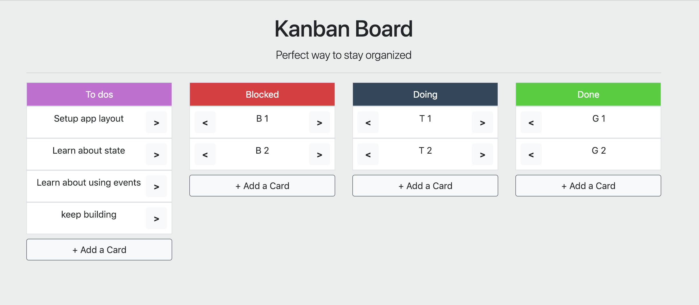

# Kanban App

1. Basic HTML/CSS layout - `start` branch
1. Finished React app layout - `layout` branch (Lab 1: Solution)
1. Functional Kanban App - `final` branch (Lab 2: Solution)

### Lab #1: Create a React app to mimic the layout of the Kanban app
1. App setup with `Create React App`
1. Create App, Column, Card, AddCardBtn components
1. The columns should be titled as in the picture
1. Cards and Columns should be rendered programmatically, vs. statically
1. The **Done** column cards do not have right arrow button. The **To do** column cards do not have the left arrow

### Lab #2: Make the app functional
1. **Add a Card** button should **prompt** the user to enter text which creates a new card on the list
1. The right and left arrow buttons should move the card on the next column of the kanban board
1. Extra credit: double-clicking the card should **prompt** to edit the card
